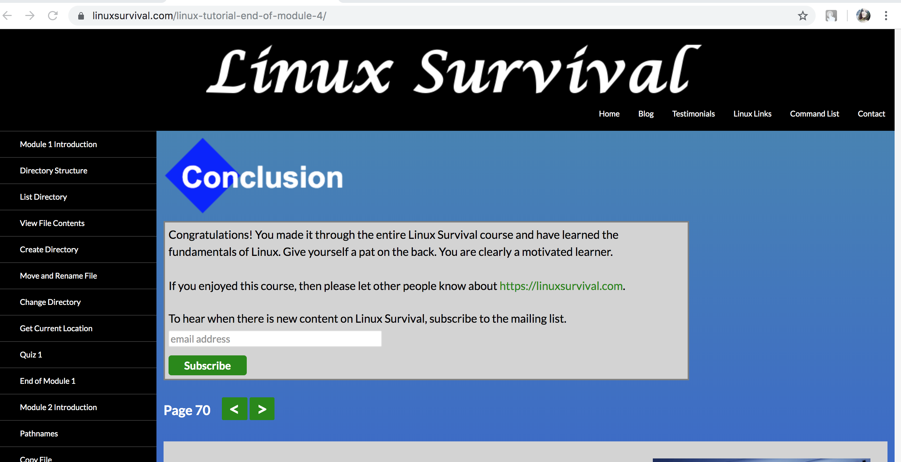
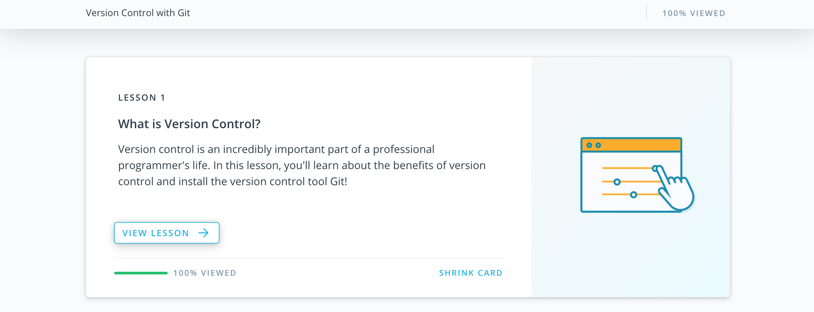
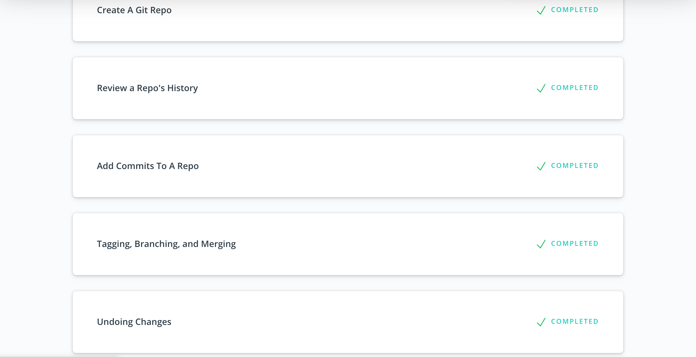
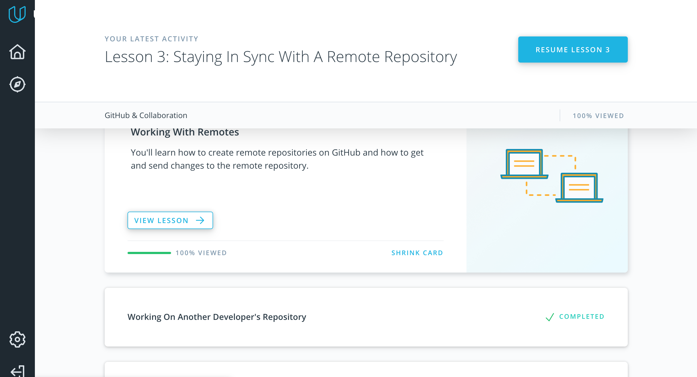

## Git Impressions
- It is a good start of adventures with GIT :)

## Unix Shell



## Git Collaboration
- Enjoyed with lessons. 
Structured materials helped to refresh some gaps (example, with rebasing :)








## Memory Management
- [X] What's going to happen if program reaches maximum limit of stack ?

    If the maximum stack size has been reached, we have a stack overflow and the program receives a Segmentation Fault. 

- [X] What's going to happen if program requests a big (more then 128KB) memory allocation on heap ?

    It will create an anonymous mapping instead of using heap memory. 
    Anonymous mapping that does not correspond to any files, 
    being used instead for program data.

- [X] What's the difference between Text and Data memory segments ?

    A text segment  is one of the sections of a program in an object file or 
    in memory, which contains executable instructions. Usually, the text segment is sharable so that 
    only a single copy needs to be in memory for frequently executed programs, such as text editors, 
    the C compiler, the shells, and so on. Also, the text segment is often read-only, 
    to prevent a program from accidentally modifying its instructions.

    Data segment is a portion of virtual address space of a program, which contains the global variables 
    and static variables that are initialized or not initialized (BSS) by the programmer.
    Data segment is not read-only, since the values of the variables can be altered at run time.

    - [X] Result of vmmap command
    
    **Heap** - 55f16c1b6000-55f16c1d7000, **Stack** - 7ffddb215000-7ffddb236000, **MMS** - 7fd078843000-7fd078a2a000.
    
```md
alaty@quebec:~/Desktop/kottans-backend$ ps -a | grep pycharm
 8536 tty2     00:00:00 pycharm.sh
alaty@quebec:~/Desktop/kottans-backend$ cat /proc/8536/maps
55f16ad0d000-55f16ad29000 r-xp 00000000 fd:01 14549026                   /bin/dash
55f16af28000-55f16af2a000 r--p 0001b000 fd:01 14549026                   /bin/dash
55f16af2a000-55f16af2b000 rw-p 0001d000 fd:01 14549026                   /bin/dash
55f16af2b000-55f16af2d000 rw-p 00000000 00:00 0 
55f16c1b6000-55f16c1d7000 rw-p 00000000 00:00 0                          [heap]
7fd078843000-7fd078a2a000 r-xp 00000000 fd:01 2888391                    /lib/x86_64-linux-gnu/libc-2.27.so
7fd078a2a000-7fd078c2a000 ---p 001e7000 fd:01 2888391                    /lib/x86_64-linux-gnu/libc-2.27.so
7fd078c2a000-7fd078c2e000 r--p 001e7000 fd:01 2888391                    /lib/x86_64-linux-gnu/libc-2.27.so
7fd078c2e000-7fd078c30000 rw-p 001eb000 fd:01 2888391                    /lib/x86_64-linux-gnu/libc-2.27.so
7fd078c30000-7fd078c34000 rw-p 00000000 00:00 0 
7fd078c34000-7fd078c5b000 r-xp 00000000 fd:01 2888363                    /lib/x86_64-linux-gnu/ld-2.27.so
7fd078e3d000-7fd078e3f000 rw-p 00000000 00:00 0 
7fd078e5b000-7fd078e5c000 r--p 00027000 fd:01 2888363                    /lib/x86_64-linux-gnu/ld-2.27.so
7fd078e5c000-7fd078e5d000 rw-p 00028000 fd:01 2888363                    /lib/x86_64-linux-gnu/ld-2.27.so
7fd078e5d000-7fd078e5e000 rw-p 00000000 00:00 0 
7ffddb215000-7ffddb236000 rw-p 00000000 00:00 0                          [stack]
7ffddb2a8000-7ffddb2ab000 r--p 00000000 00:00 0                          [vvar]
7ffddb2ab000-7ffddb2ac000 r-xp 00000000 00:00 0                          [vdso]
ffffffffff600000-ffffffffff601000 r-xp 00000000 00:00 0                  [vsyscall]

```

Memory management is too useful topic for learning.
In spite of we are working with program languages ​​which has garbage collector which makes our life easier,
we need to keep in mind how memory is used and which problem can occur in case of incorrect using it to prevent memory
leaks and other possible problems. Tasks contain description of different memory segments, what type of data
is stored there, which errors occur in case of using more memory than allowed. 
P.S. I have a new goal - be better in understanding of memory usage. It is task for future improvement :)
